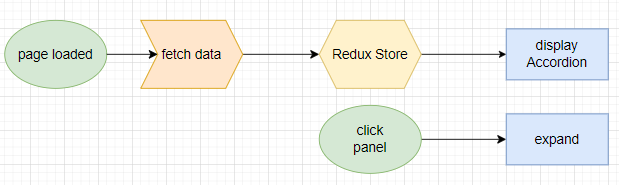
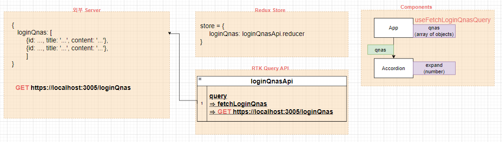
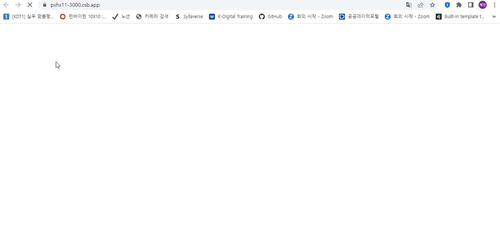

# ✔ Accordion Page 만들기

-   개요: Q&A 아코디언 페이지 만들기
-   주요 개념: `useState()`, `map`, `react-icons`

## 🎨 FlowChart & Structure

### ▶ FlowChart

### ▶ Structure

## 🧩 실습 결과물

-   사이트 링크: <https://pxhx11-3000.csb.app/>
-   CodeSandbox 링크: <https://codesandbox.io/p/sandbox/accordion-pxhx11>

## 💡 후기

### ▶ 튜토리얼 vs 나의 코드

> 튜토리얼

-   data.js 파일로부터 데이터를 가져왔음
-   App component에서 각 데이터를 서로 다른 Question component로 넘겨줌
-   Question component에서 showInfo state toggle을 통해 answer 부분을 보여줄지 말지 결정함

> 나의 코드

-   RTK Query를 통해 서버로부터 데이터를 가져왔음
-   App component에서 `useFetchLoginQnasQuery` 훅을 호출해 데이터를 가져오기만 한 후, Accordion component로 데이터를 전부 넘겨줬음
-   Accordion component에서 각 데이터를 나열하고, Q&A를 클릭할 때마다 해당 id값으로 expand state을 변경해줬음
-   expand state에 해당하는 Q&A만 info를 보여주는 방식으로 아코디언을 구현함
