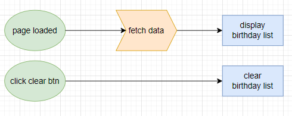
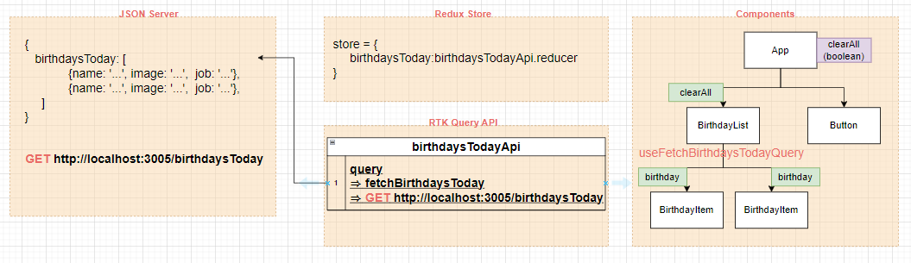
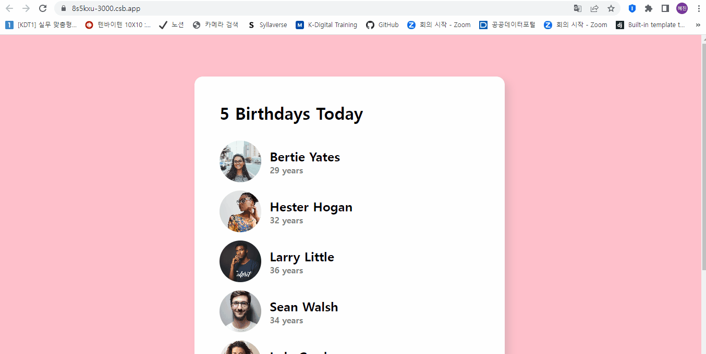

# ✔ Birthday Reminder 만들기

-   개요: 생일 알림 앱 만들기
-   주요 개념: `useState()`, `import/export`, `JSX`, `map()`

## 🎨 FlowChart & Structure

### ▶ FlowChart



### ▶ Structure



#### ➕ 폴더 및 파일 구조

```
project
    ↳ public
    ↳ src
        ↳ components
        ↳ store
        ↳ styles
        ↳ App.js
        ↳ index.js
    ↳ package.json
```

-   Button component와 같이 재사용이 높은 common components는 각자 scss 파일을 생성함 (ex) button.scss)
    -   이때는 OOCSS 방법론을 이용해 selector 작성
-   이외의 스타일은 각 페이지별로 하나의 scss 파일을 생성함 (ex) main.scss)
    -   이때는 BEM 방법론을 이용해 selector를 작성해서, 다른 scss 파일 내에 있는 selectors와 중복되지 않게 하고자 함

## 🧩 실습 결과물

-   사이트 링크: <https://8s5kxu-3000.csb.app/>
-   CodeSandbox 링크: <https://codesandbox.io/p/sandbox/birthday-reminder-8s5kxu>



## 💡 후기

### ▶ 튜토리얼 vs 나의 코드

> 튜토리얼

-   js 파일에 데이터를 저장한 후 사용했음
-   App component에 직접 button html element를 사용했음
-   App component에 people state를 만들어 데이터를 저장해뒀음
-   List component에서 모든 데이터를 화면에 뿌려줬음

> 나의 코드

-   RTK Query와 JSONServer를 사용해 서버로부터 직접 데이터를 받아왔음
    -   네트워크를 사용했기 때문에, 로딩과 에러 처리까지 해줬음
-   재사용 가능한 Button component를 따로 만들어 활용했음
-   Redux Store에 fetch한 데이터/status/loading 등의 정보를 저장한 후, component에서 가져와 사용했음
-   App component에는 전체 삭제 여부를 저장하는 clearAll state를 생성해 Button 클릭 여부에 따라 값을 변경하였음
-   BirthdayList component는 오로지 서버로부터 데이터를 받아 각 BirthdayItem component에 전달하고 나열하는 역할만 함
