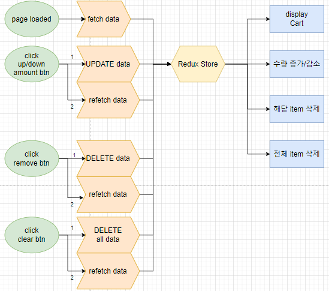
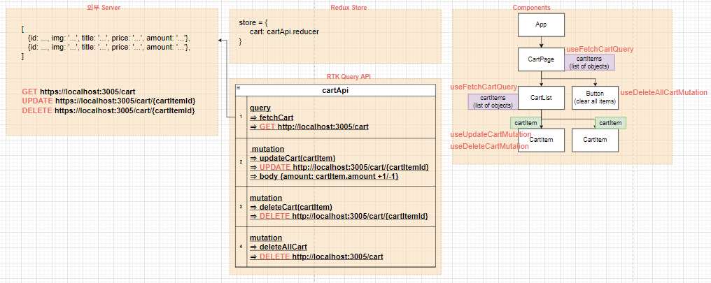
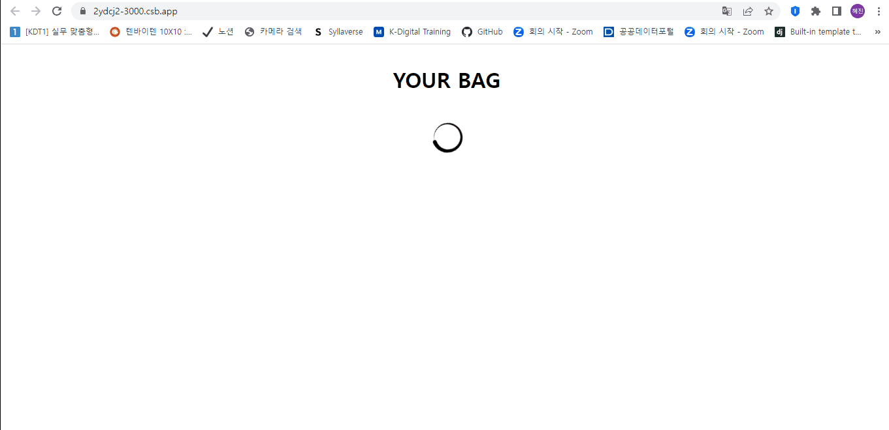

# ✔ 장바구니 페이지 만들기

-   개요: 상품을 추가하고 삭제할 수 있는 장바구니 페이지 만들기
-   주요 개념: `useReducer()`, `useContext()`, `map()`, `filter()`

## 🎨 FlowChart & Structure

### ▶ FlowChart

### ▶ Structure

## 🧩 실습 결과물

-   사이트 링크: <https://2ydcj2-3000.csb.app/>
-   CodeSandbox 링크: <https://codesandbox.io/p/sandbox/cart-2ydcj2>

## 💡 후기

### ▶ 이슈 및 해결과정

> 이슈

수량 증가/감소하기 위해 아이콘을 눌러도, 제대로 request가 가지 않는 문제가 발생했다.

> 해결과정

JSON-Server로 PUT이나 PATCH method로 request를 보내는 것에 문제가 있는 것 같다. codesandbox 온라인 에디터를 사용했기 때문에 baseURL 설정을 'localhost'가 아닌 이 프로젝트의 url명을 직접 적었는데도 여전히 에러가 발생했다. 아직 정확한 원인을 찾지 못해 해결을 하지 못했다...

### ▶ 튜토리얼 vs 나의 코드

> 튜토리얼

-   `useReducer` 훅을 사용해 state를 관리하고, `Context API`로 전체 components에 'state'와 dispatch를 보내는 'handler functions'를 공유했음
-   초기 cart 데이터를 받기 위해 특정 URL로 request를 보내 데이터를 받은 후 initialState로 할당해주었음
    -   initialState에는 cart state뿐만 아니라 total, amount, loading state도 포함되어 있음
    -   useEffect 훅에 의해 cart state가 변경될 때마다 total 값을 자동으로 다시 구하게 했음
-   수량을 추가/감소시키고 삭제하는 과정은 서버와의 통신 없이 오로지 state만 변경해줬음

> 나의 코드

-   `Redux` 라이브러리를 사용해 state를 관리하고, `React-Redux` 라이브러리를 통해 react와 redux store를 연결시켜줬음
-   `RTK Query`를 사용해 JSON-Server로부터 초기 cart 데이터를 fetch했음
-   수량을 추가/감소시키고 삭제하는 과정 역시 서버와의 통신 후 cart 데이터를 refetch해주는 방식으로 진행했음
-   튜토리얼처럼 total state를 따로 두지 않은 이유는, 기존 cart state로부터 충분히 계산할 수 있는 값이기 때문에 굳이 state로 따로 만들어주진 않았음
