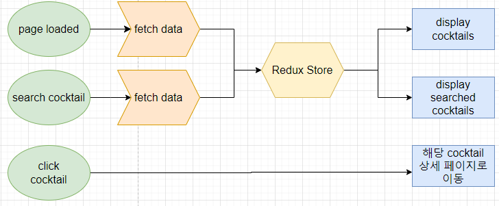
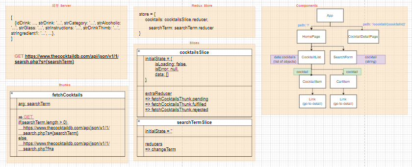

# ✔ 칵테일 검색 페이지 만들기

-   개요: react-router를 이용해 칵테일 검색 페이지 만들기
-   주요 개념: `useEffect()`, `useState()`, `useContext()`, `useCallback()`, `<Router>`, `Switch`

## 🎨 FlowChart & Structure

### ▶ FlowChart

### ▶ Structure

## 🧩 실습 결과물

-   사이트 링크: <https://qsjljj.csb.app>
-   CodeSandbox 링크: <https://codesandbox.io/s/cocktails-qsjljj>

## 💡 후기

### ▶ 이슈 및 해결과정

#### 1️⃣ 이슈 1

> 이슈

cocktail 상세 페이지에서 뒤로 가기를 누르면 URL의 path가 '/cocktail/cocktail/{idDrink}'으로 변경이 된다.

> 해결과정

아직 원인을 찾지 못해 해결을 하지 못했다.

#### 2️⃣ 이슈 2

> 이슈

home 페이지에서 검색된 결과로 나온 cocktails 중 하나의 cocktail detail 버튼을 눌러 상세 페이지로 이동하는 것이 아닌, 주소창에 바로 'cocktail/{idDrink}' 경로를 쳐서 이동하는 경우 cocktailDetailPage가 render되지 않는 문제가 발생했다.

> 해결과정

cocktailDetailPage component가 render될 때, redux store의 cocktails.data에서 path에 포함한 idDrink와 일치하는 데이터를 찾아 render하기 때문에 주소창에 바로 경로를 치는 경우 cocktails.data 값은 empty array 상태이어서 위와 같은 이슈가 발생한 것으로 보인다.

이 이슈를 해결하기 위해, 아래 두 가지 방법을 생각해 보았다.

1. 방법 1

    - cocktails state에서 cocktailDetail state 추가하고, 상세 페이지에 띄울 특정 한 cocktail에 대한 데이터를 여기에 저장하기
    - cocktails state에서 loading, error state는 빼서 react에서 hook으로 처리하기
    - cocktailDetailPage를 render할 때 특정 한 cocktail에 대한 데이터를 fetch하기 위한 thunk function을 새로 만들기
    - thunk function을 실행하고 loading/error state를 처리하는 hook function을 만든 후, 상세 페이지에서 이 hook을 사용해 데이터를 가져와 render하기

2. 방법 2

    - 아예 redux store에 cocktails state처럼 cocktailDetail state를 따로 만들기
    - RTK query를 사용해 상세 페이지에 띄울 특정 한 cocktail에 대한 데이터를 가져와 cocktailDetail state에 저장하기

위 두 방법 중 두 번째 방법을 선택하였다. 그 이유는 만약 특정 cocktail에 대한 상세 페이지를 중복해서 방문한다고 가정하면, 방법1을 사용했을 땐 그때마다 계속해서 새로 동일한 query를 보내야 하지만, 방법2를 사용하면 기존 데이터가 저장되어 있기 때문에 또 다시 query를 보낼 필요 없이 활용하면 되므로 이 방법이 더 효율적이라 생각했다.

방법 2를 통해 코드를 수정하였지만, 여전히 주소창에 'cocktail/{idDrink}' 경로를 바로 쳐서 들어가는 경우 cocktail 상세 페이지가 아닌 home page가 나타났다. 아직까지 이유를 알 수 없어서 해결하지 못했다.

### ▶ 튜토리얼 vs 나의 코드

> 튜토리얼

-   `useState` 훅과 `context`를 사용해 searchTerm, cocktails, loading state를 생성하고 components에 공유했음
-   context custom provider에서 searchTerm state가 변경될 때마다 axios을 통해 데이터를 fetch해왔음
-   `react-router-dom` 라이브러리를 사용해 경로에 따라 페이지를 라우터했음

> 나의 코드

-   `Redux Store`와 `React-Redux`를 사용해 searchTerm, cocktails, cocktailDetail state를 생성하고 components에 공유했음
-   CocktailList component에서 searchTerm state가 변경될 때마다 thunk function을 사용해 데이터를 fetch해왔음
-   직접 Route, Link component를 생성하고 currentPath state와 navigate function을 context로 공유함으로써 라우터 기능을 구현했음
