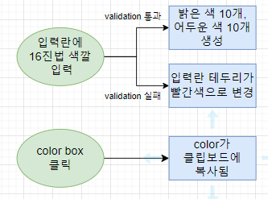
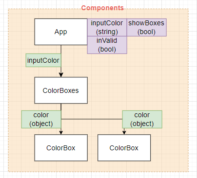
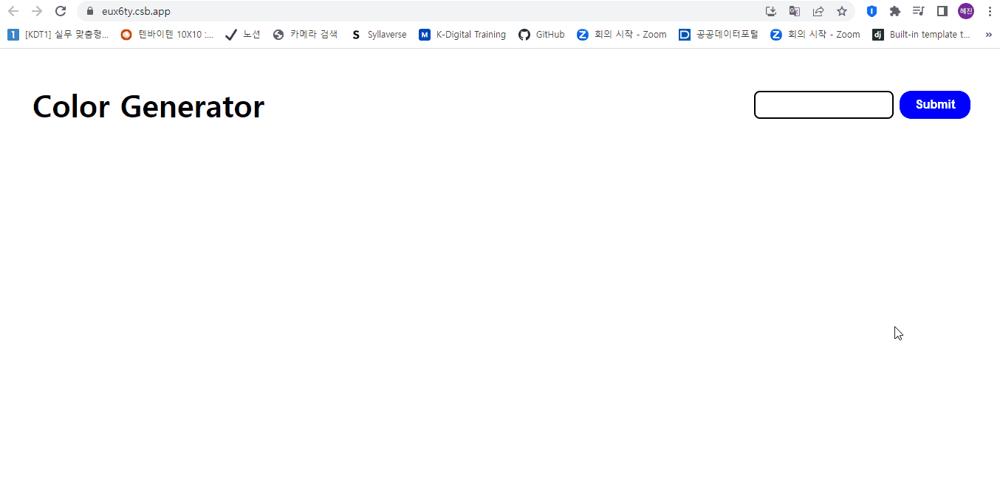

# ✔ Color Generator 만들기

-   개요: 컬러 제너레이터 만들기
-   주요 개념: `useState()`, `useEffect()`, `setTimeout()`, `clearTimeout()`, `try...catch문`, `event.preventDefault()`

## 🎨 FlowChart & Structure

### ▶ FlowChart

### ▶ Structure

## 🧩 실습 결과물

-   사이트 링크: <https://eux6ty.csb.app/>
-   CodeSandbox 링크: <https://codesandbox.io/s/color-generator-eux6ty>

## 💡 후기

### ▶ 튜토리얼 vs 나의 코드

> 튜토리얼

> 나의 코드
