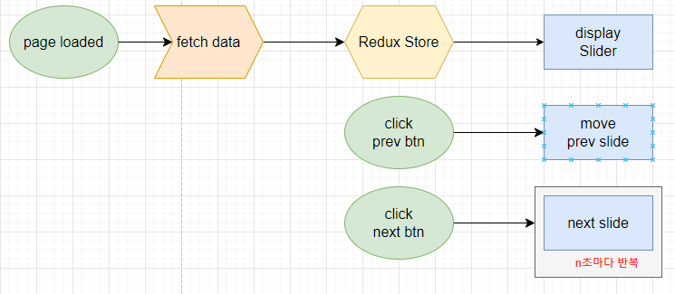
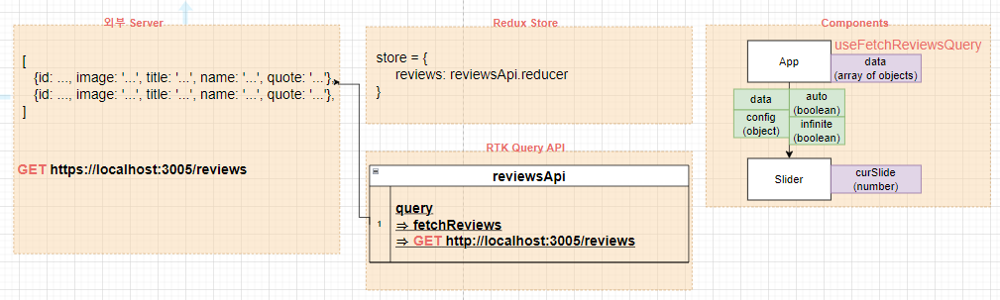
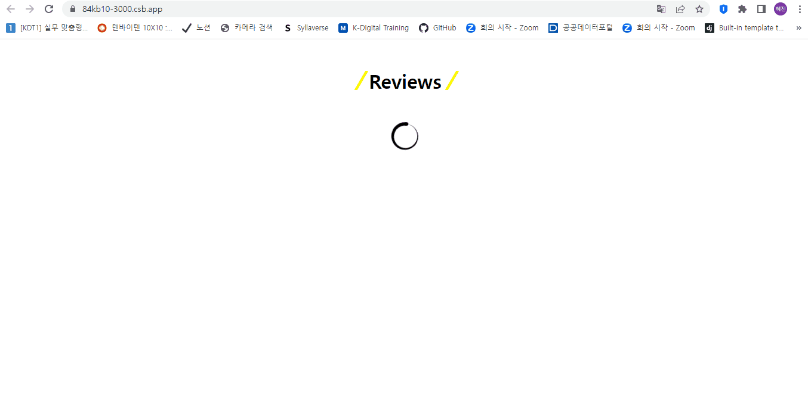

# ✔ Review Slider 만들기

-   개요: 몇 초마다 새로운 리뷰를 보여주는 자동 리뷰 슬라이더 만들기
-   주요 개념: `useState()`, `useEffect()`, `map`, `react-icons`

## 🎨 FlowChart & Structure

### ▶ FlowChart



### ▶ Structure



## 🧩 실습 결과물

-   사이트 링크: <https://84kb10-3000.csb.app/>
-   CodeSandbox 링크: <https://codesandbox.io/p/sandbox/slider-84kb10>



## 💡 후기

### ▶ 이슈 및 해결과정

#### 1️⃣ 이슈1

> 이슈

아래와 같은 코드를 실행했을 때, 마지막 슬라이드(index = 4)에서 next 버튼을 클릭할 경우 차례로 cloned slide(index = 5)로 넘어가고 1초 후에 transition 없이 첫번째 슬라이드(index = 1)로 넘어갈 것으로 예상했다.
하지만, 예상과 달리 cloned slide로 넘어가지 않고 바로 첫번째 슬라이드(index = 1)로 넘어갔다.

```js
const nextSlide = function () {
  if (curSlide === lastSlide && infinite) {
    setCurSlide(curSlide + 1);
    slideList.current.style.transition = "0s";
    setCurSlide(firstSlide);
  }
  ...
};
```

> 해결과정

next 버튼을 클릭했을 때 cloned slide(index = 5)로 넘어가는 transition 시간(1s)을 고려하지 않았기 때문에, 바로 첫번째 슬라이드로 넘어간 것처럼 보였던 것 같다.

`setTimerout()` 함수를 사용해 `setCurSlide(curSlide + 1)`을 실행하고 transition 시간(1s)이 흐른 후에 `setCurSlide(firstSlide)`가 실행되도록 수정해주었다.

```js
const nextSlide = function () {
  if (curSlide === lastSlide && infinite) {
    setCurSlide(curSlide + 1);
    setTimeout(() => {
      slideList.current.style.transition = "0s";
      setCurSlide(firstSlide);
    }, transitionTime * 1000);
  }
  ...
};
```

#### 2️⃣ 이슈2

> 이슈

마지막 슬라이드(index = 4)에서 next 버튼을 연속으로 두 번 클릭할 경우, curSlide state가 5(cloned slide)에서 6으로 빠르게 증가해 빈 slide가 나타났다가, `setTimeout()` 함수에 적용한 transition time(1s)이 끝난 후 그제야 첫번째 슬라이드(index = 1)로 넘어가는 문제가 발생했다.

> 해결과정

중복 클릭 이벤트에 대한 handler 연속 호출을 막아, 한 handler의 실행이 끝나지도 않았는데 또 다른 handler가 호출되는 경우를 없애고자 했다.

이를 위해, 현재 클릭 이벤트가 진행 중인지 여부를 기록하는 `isMoving` state를 만들었다. 클릭이벤트 handler가 호출되었을 때 `isMoving` state를 true로 설정해주고, 원하는 작업을 다 끝냈을 때 `isMoving` state를 false로 다시 바꿔줌으로서 중복 클릭이벤트에 대한 handler 연속 호출을 막을 수 있었다.

```js
const [isMoving, setIsMoving] = useState(false);

const nextSlide = function () {
    if (isMoving) return;
    setIsMoving(true);

    if (curSlide === lastSlide && infinite) {
      ...
    }
    ...

    setTimeout(() => {
        setIsMoving(false);
      }, transitionTime * 1000);
  };
```

#### 3️⃣ 이슈3

> 이슈

-   자동 슬라이드를 구현하기 위해, 아래 코드처럼 useEffect hook 안에 `setInterval` 함수를 실행했는데 마지막 슬라이드 (index = 4)에서 다시 첫번째 슬라이드 (index = 1)로 돌아오지 못하고 slide index가 6을 넘어서까지 이동하는 문제가 발생했다.

```js
useEffect(() => {
	const interval = setInterval(moveToSlide, intervalTime * 1000, "next");
}, []);
```

```js
const moveToSlide = function (direction) {
  ...
  if (curSlide === limitSlide && infinite) {
    ...
  } else if (curSlide === limitSlide) {
    ...
  } else {
    ...
  }
  ...
};
```

> 해결과정

알고보니 moveToSlide 함수 내의 curSlide 값이 state가 바뀔 때마다 새로 갱신되는 게 아니라 useEffect hook이 처음 실행될 때의 curSlide state 값(= 1)으로 계속 유지되었기 때문이었다. 따라서, 함수 밖에서 curSlide state가 계속 변경되어도 moveToSlide 함수 내에서의 curSlide는 변하지 않기 때문에 `curSlide === limitSlide` 조건문을 항상 만족하지 못했던 것이다.

moveToSlide 함수 내의 curSlide 값이 state가 바뀔 때마다 새로 갱신되도록 하기 위해, Slider component가 rerender될 때마다 useEffect hook이 실행되어 `setInterval` 함수가 새로 생성되게끔 수정하였다. 이때, cleanup function을 반환해주어 rerender될 때마다 기존 `setInterval` 함수을 삭제해주었다.

```js
useEffect(() => {
	const interval = setInterval(moveToSlide, intervalTime * 1000, "next");
	return () => clearInterval(interval);
});
```

### ▶ 튜토리얼 vs 나의 코드

> 튜토리얼

-   App component에서 바로 data.js 파일에 있는 데이터를 받아 슬라이더를 만들어 주었음
-   일단, 모든 slide가 한 위치에 겹쳐 있도록 스타일링을 한 후, 현재/직전/다음 슬라이드를 각각 'activeSlide'/'lastSlide'/'nextSlide'로 클래스명을 달아줘 opacity와 translateX를 다르게 주었음
-   useEffect hook을 사용해 현재 slide의 index가 범위를 벗어나면 다시 설정해주게끔 했음

> 나의 코드

-   RTK query를 통해 JSONServer로부터 데이터를 요청했음
-   App component에서 `useFetchReviewsQuery` hook을 실행해 데이터를 받아, Slider component로 넘겨줬음
-   재사용하기 쉽고 유연한 Slider component를 만들기 위해, Slider는 data/config/transitionTime/intervalTime/auto/infinite props를 받아 작동하게 됨
    -   `auto`는 Slider가 자동으로 움직이는지 여부를 의미함
    -   `infinite`는 Slider의 마지막 slide 다음에 첫번째 slide가 자연스럽게 이어지는지를 의미함
    -   `transitionTime`는 slide가 움직이는 시간을 의미함
    -   `intervalTime`는 자동으로 slide가 움직이는 시간을 의미함
    -   `data`는 array of objects의 형태로 화면에 보여줄 실제 데이터를 의미함
    -   `config`는 objects의 형태로 `renderContent`/`renderControllerPrev`/`renderControllerNext` 세 개의 methods를 가지고 있어야 함
        -   renderContent: 한 데이터 값(object)을 받아 'slide'에 나타낼 데이터 종류와 custom jsx를 반환해주는 함수
        -   renderControllerPrev: 'prev btn'에 나타낼 custom jsx를 반환해주는 함수
        -   renderControllerNext: 'next btn'에 나타낼 custom jsx를 반환해주는 함수
-   모든 slide를 왼쪽에서 오른쪽으로 순서대로 세운 후, curSlide state에 따라 translateX를 사용해 slide list를 옮겨주었음
-   무한 슬라이드를 구현하기 위해, 현재 data 가장 앞에 젤 뒤에 있는 데이터를 복사해서 넣어주고, 현재 data 가장 뒤에 젤 앞에 있는 데이터를 복사해서 넣어줌
-   curSlide state를 변경해줄 때 미리 범위를 벗어났는지 파악하고 변경해주었음
