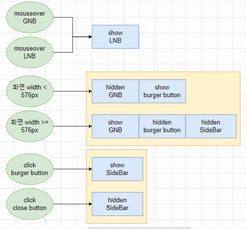
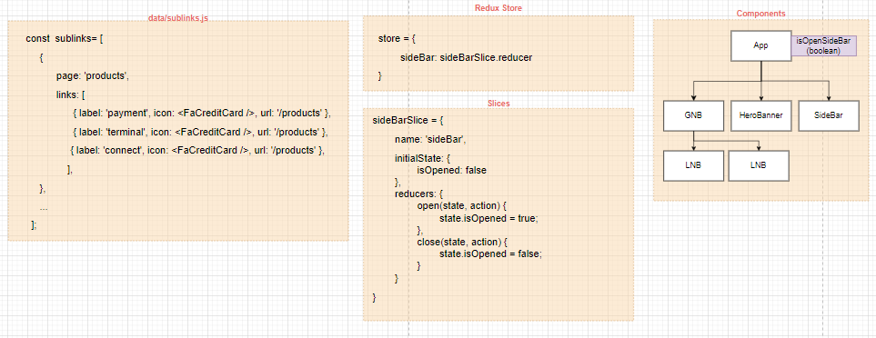
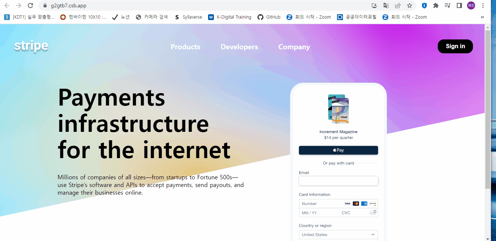

# ✔ Stripe 결제 페이지 만들기

-   개요: Stripe 사의 랜딩 페이지 만들기
-   주요 개념: `useState()`, `useEffect()`, `useContext()`, `useRef()`, `react-icons`

## 🎨 FlowChart & Structure

### ▶ FlowChart

### ▶ Structure

## 🧩 실습 결과물

-   사이트 링크: <https://g2gtb7.csb.app/>
-   CodeSandbox 링크: <https://codesandbox.io/s/stripe-g2gtb7>

## 💡 후기

### ▶ 튜토리얼 vs 나의 코드

> 튜토리얼

> 나의 코드
