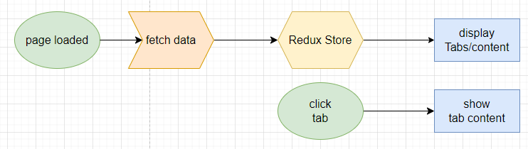
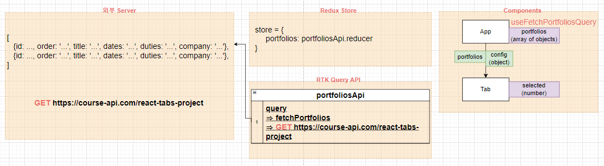
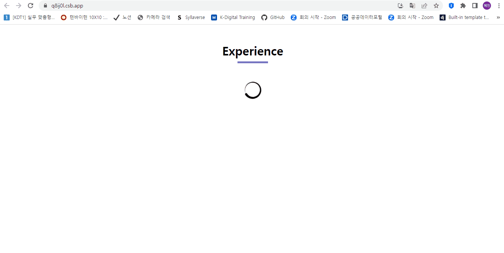

# ✔ Tabs 만들기

-   개요: 가짜 포트폴리오 웹 페이지에서 tab 만들기
-   주요 개념: `useState()`, `useEffect()`, `async/await`, `react-icons`

## 🎨 FlowChart & Structure

### ▶ FlowChart

### ▶ Structure

## 🧩 실습 결과물

-   사이트 링크: <https://q8ij0l.csb.app/>
-   CodeSandbox 링크: <https://codesandbox.io/s/tabs-q8ij0l>

## 💡 후기

### ▶ 튜토리얼 vs 나의 코드

> 튜토리얼

-   App component에서 fetch() function을 사용해 직접 서버로부터 데이터를 가져옴
-   App component에서 value state를 생성해 클릭한 tab의 인덱스를 저장함

> 나의 코드

-   RTK Query를 사용해 서버로부터 데이터를 가져와 Redux Store에 저장
-   App component는 Tab component에 데이터를 넘겨주기만 하고, Tab component에서 selected state를 생성해 클릭한 tab의 인덱스를 저장함
-   재사용하기 쉬운 유연한 Tab component를 만들기 위해, Tab은 data와 config props를 받아 작동하게 됨
    -   `data`는 array of objects의 형태로 화면에 보여줄 실제 데이터를 의미함
    -   `config`는 objects의 형태로 `renderTab`/`renderContent` 두 개의 methods를 가지고 있어야 함
        -   renderTab: 한 데이터 값(object)을 받아 'tab button'에 나타낼 데이터 종류와 custom jsx를 반환해주는 함수
        -   renderContent: 선택된 한 데이터 값(object)을 받아 'tab content'에 나타낼 데이터 종류와 custom jsx를 반환해주는 함수
