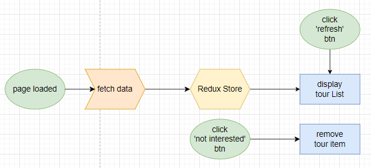
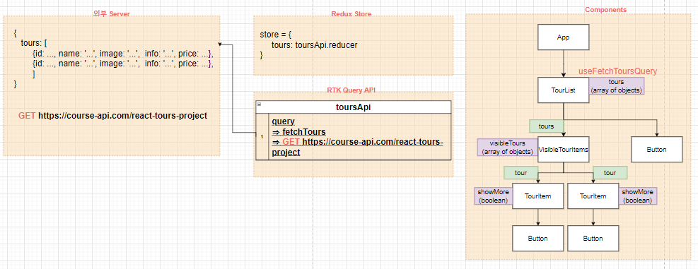

# ✔ Tour Page 만들기

-   개요: user가 관심 없는 여행지를 삭제할 수 있는 여행 페이지 만들기
-   주요 개념: `useState()`, `try ~ catch문`, `async/await`, `useEffect()`

## 🎨 FlowChart & Structure

### ▶ FlowChart

### ▶ Structure

## 🧩 실습 결과물

-   사이트 링크: <https://20wtk9.csb.app/>
-   CodeSandbox 링크: <https://codesandbox.io/s/tours-20wtk9>

## 💡 후기

### ▶ 이슈 및 해결과정

> 이슈

원래 처음엔 VisibleTourItems component 없이, TourList와 TourItem component만 두고 TourList component에 `useFetchToursQuery` 훅을 호출해 서버에서 데이터를 받고 이 데이터를 `visibleTours` state이 초기값으로 넘겨주려 했다.
하지만, 데이터를 fetching하는 과정에서는 'data = undefined'이기 때문에 `visibleTours` state에 초기값으로 undefined가 할당되는 이슈가 발생했다.

> 해결 과정

서버로부터 데이터를 정확히 받아 온 이후에 `visibleTours` state를 생성해야겠다고 생각했다. `visibleTours` state를 생성뿐만 아니라 이 state와 관련된 두 개의 handler도 함께 위치해야했기에, 화면에 보여줄 tours만 필터링해주는 VisibleTourItems component를 TourList와 TourItem component 사이에 만들었다.

### ▶ 튜토리얼 vs 나의 코드

> 튜토리얼

-   App component에서 loading state를 직접 생성해 데이터 fetch 전.후로 값을 변경해줬음
-   App component에서 fetch() API를 사용해 서버로부터 데이터를 가져와, tours state를 변경해줬음
-   try...catch문을 통해 에러 처리를 해줌
-   useEffect를 사용해서 App component가 처음 render될 때 위 세 과정을 실행함
-   App component에서 tours state에 값이 없을 때, refresh 버튼이 나타나게 하고 버튼을 클릭하면 다시 fetch() API를 이용해 서버로부터 데이터를 가져옴
-   App에서 tours state를 만들었기 때문에, App → Tours → Tour component로 handler를 전달해야 했음

> 나의 코드

-   RTK Query를 사용해 서버로부터 데이터를 가져옴
-   RTK Query가 자동으로 생성한 `useFetchToursQuery` 훅의 반환값을 통해 isLoading, isError 등의 정보를 얻었음
-   useEffect 사용 없이도 TourList component가 첫번째 render될 때만 `useFetchToursQuery` 훅이 실행됨
-   refresh 버튼을 클릭하면 처음에 fetch해서 가져왔던 기존 데이터로 visibleTours state를 변경해 줌
-   TourList component는 오로지 서버로부터 데이터를 가져와 넘겨주는 역할만 했기 때문에, VisibleTourItems component에서 화면에 보여지는 tours를 따로 처리했음
